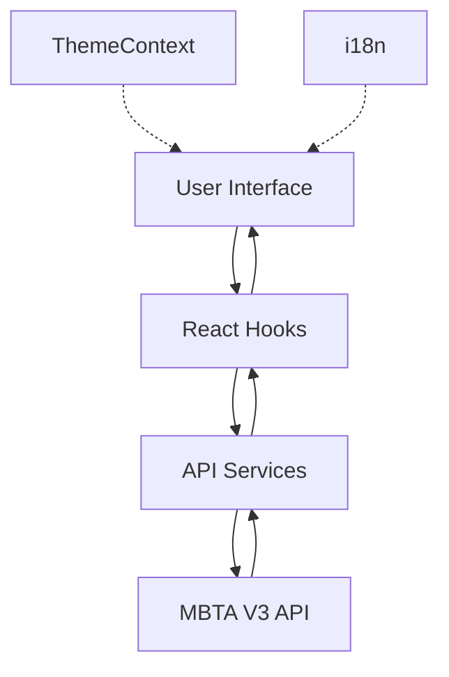

# Project Architecture

This document describes the technical architecture, folder structure, and data flow of the Transjakarta Fleet Management App.

## System Overview

The application is built with React Native and TypeScript, designed to provide real-time vehicle tracking using the MBTA V3 API. It emphasizes modularity, type safety, and a consistent user experience across different themes and languages.

## Folder Structure

```text
src/
├── components/     # Reusable UI components (Cards, Skeletons, etc.)
├── languages/      # Localization configuration and translation files (JSON)
├── navigation/     # Navigation logic and stack definitions
├── screens/        # Main application screens
├── services/       # API integration and data fetching logic
├── theme/          # Theme configuration and Context provider
├── types/          # TypeScript interfaces and type definitions
└── App.tsx         # Application entry point and provider setup
```

## Key Architectural Components

### 1. Data Flow & API Integration
The app uses a service-based approach for data fetching.
- **Service Layer (`src/services/api.ts`)**: Encapsulates all fetch calls to the MBTA API. It handles pagination, filtering (by route, trip, or label), and error handling.
- **Data Consumption**: Screens call these services and manage the returned data using React hooks (`useState`, `useEffect`).

### 2. State Management
- **Local State**: Most UI-specific state (like search queries or filter selections) is managed locally within components or screens.
- **Global State (Context API)**: Used for cross-cutting concerns like Theme management.
  - `ThemeContext`: Manages the current theme (Light/Dark) and persists the user's preference using `AsyncStorage`.

### 3. Navigation
The app uses **React Navigation** with a Native Stack Navigator.
- **Flow**: `Splash` -> `Home` -> `Detail` / `Filter`.
- **Transitions**: Configured with smooth slide animations.

### 4. Internationalization (i18n)
Implemented using `i18next` and `react-i18next`.
- Supports dynamic language switching.
- Translation files are organized by language code (e.g., `en.json`, `id.json`).

### 5. Styling & Theming
- **Theme Provider**: Wraps the application to provide consistent colors based on the active theme.
- **Dynamic Styling**: Components consume colors from the `useTheme` hook to ensure they adapt to theme changes instantly.

## Data Flow Diagram



## Technical Decisions

- **TypeScript**: Chosen for its ability to catch errors at compile-time and provide excellent IDE support, which is crucial for handling complex API responses.
- **Functional Components**: The entire app is built using functional components and hooks for better readability and performance.
- **AsyncStorage**: Used for lightweight persistence of user preferences (like theme) without the overhead of a full database.
